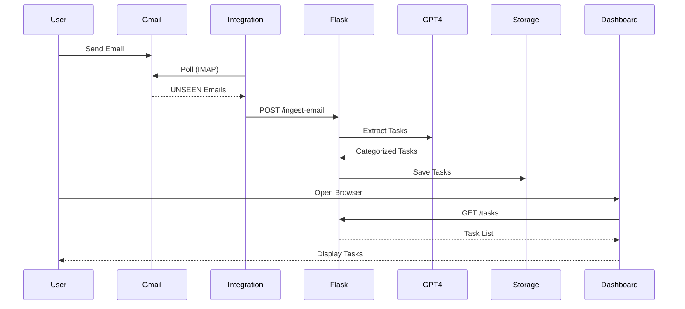

# 📧 Email-to-Task Automation System

<div align="center">


**An intelligent AI-powered system that automatically extracts actionable tasks from emails and presents them through a beautiful, interactive dashboard.**

[Features](#-features) • [Demo](#-demo) • [Quick Start](#-quick-start) • [Documentation](#-documentation) • [Deployment](#-deployment) • [Architecture](#-architecture)

</div>

---

## 🎯 Overview

Transform your inbox chaos into organized, actionable tasks with AI. This system monitors your Gmail, extracts tasks using GPT-4, categorizes them intelligently, and displays everything in a stunning dashboard with real-time analytics.

### Why This Project?

- **🤖 AI-Powered**: Uses OpenAI GPT-4 for intelligent task extraction and categorization
- **📧 100% FREE Gmail Integration**: No paid services required - uses Gmail's built-in IMAP
- **🎨 Beautiful UI**: Modern pastel design with smooth animations and dark mode
- **📊 Rich Analytics**: Interactive charts and metrics for task insights
- **🚀 Production Ready**: Complete AWS deployment guides and security documentation
- **📝 Spec-Driven**: Built using formal requirements and design specifications

---

## ✨ Features

### Core Capabilities

| Feature | Description |
|---------|-------------|
| **🤖 AI Task Extraction** | GPT-4 intelligently identifies and extracts actionable items from email content |
| **📧 Gmail Integration** | Automatic IMAP polling every 60 seconds for new emails (100% FREE) |
| **🎯 Smart Categorization** | Auto-categorizes into Work, Personal, Academic, Urgent, or Low Priority |
| **⚡ Priority Detection** | Assigns High, Medium, or Low priority based on content analysis |
| **📅 Due Date Parsing** | Extracts dates from natural language ("tomorrow", "next Friday", "by Dec 15") |
| **🔄 Duplicate Prevention** | Intelligent deduplication using normalized text matching |
| **💾 Simple Storage** | File-based JSON storage (no database setup required) |
| **🎨 Modern Dashboard** | Responsive UI with pastel colors, smooth animations, and dark mode |

### Dashboard Features

<table>
<tr>
<td width="50%">

**📊 Real-Time Metrics**
- Total task count
- Pending vs completed breakdown
- Urgent task counter
- Category distribution

</td>
<td width="50%">

**🔍 Advanced Filtering**
- Filter by category
- Filter by status (pending/done)
- Urgent-only toggle
- Clear all filters

</td>
</tr>
<tr>
<td width="50%">

**📈 Interactive Charts**
- Pie chart: Task distribution
- Bar chart: Tasks per sender
- Real-time updates
- Responsive design

</td>
<td width="50%">

**✅ Task Management**
- One-click complete/undo
- Color-coded categories
- Priority badges
- Due date display

</td>
</tr>
</table>

---

## 🎬 Demo

### Dashboard Screenshots

**Light Mode - Task Overview**
```
┌─────────────────────────────────────────────────────────────┐
│  📊 Metrics: 5 Total | 5 Pending | 0 Done | 2 Urgent       │
│  🔍 Filters: Category [All ▼] Status [All ▼]               │
│  📈 Charts: [Pie Chart] [Bar Chart]                         │
│                                                              │
│  📋 Tasks:                                                   │
│  ┌────────────────────────────────────────────────────────┐ │
│  │ 🔴 URGENT | AWS KIRO WEEK-2 SUBMISSION DUE             │ │
│  │ Due: Dec 7, 2025 | From: shreyasherikar18@gmail.com   │ │
│  │ [✓ Complete]                                           │ │
│  └────────────────────────────────────────────────────────┘ │
└─────────────────────────────────────────────────────────────┘
```

### Email Processing Flow

```
📧 New Email Arrives
    ↓
🔍 Gmail Integration Detects (IMAP)
    ↓
🤖 GPT-4 Extracts Tasks
    ↓
📝 Tasks Stored (JSON)
    ↓
📊 Dashboard Updates (Real-time)
```

---

## 🚀 Quick Start

### Prerequisites

- **Python 3.11+** ([Download](https://www.python.org/downloads/))
- **Gmail Account** with IMAP enabled
- **OpenAI API Key** (Optional - has fallback mode)

### Installation (5 Minutes)

#### 1️⃣ Clone Repository

```bash
git clone https://github.com/yourusername/email-task-automation.git
cd email-task-automation
```

#### 2️⃣ Set Up Environment

**Windows:**
```bash
python -m venv venv
venv\Scripts\activate
pip install -r requirements.txt
```

**Linux/Mac:**
```bash
python3 -m venv venv
source venv/bin/activate
pip install -r requirements.txt
```

#### 3️⃣ Configure Gmail

1. **Enable IMAP** in Gmail Settings → Forwarding and POP/IMAP
2. **Generate App Password**:
   - Go to [Google Account Security](https://myaccount.google.com/security)
   - Enable 2-Step Verification
   - Generate App Password for "Mail"
3. **Copy `.env.example` to `.env`**:
   ```bash
   cp .env.example .env
   ```
4. **Edit `.env`** with your credentials:
   ```env
   GMAIL_USER=your.email@gmail.com
   GMAIL_APP_PASSWORD=your_16_char_app_password
   OPENAI_API_KEY=sk-proj-... # Optional
   ```

#### 4️⃣ Run Application

**Terminal 1 - Flask Server:**
```bash
python app.py
```

**Terminal 2 - Gmail Integration:**
```bash
python gmail_integration.py
```

**Terminal 3 - Open Dashboard:**
```bash
# Open browser to http://localhost:8000
```

### Quick Test

```bash
# Test Gmail connection
python check_gmail_status.py

# Send test email manually
python test_manual_email.py
```

---

## 📚 Documentation

### 📖 Setup Guides

| Document | Description |
|----------|-------------|
| **[QUICK_START.md](QUICK_START.md)** | Detailed setup instructions with troubleshooting |
| **[GMAIL_SETUP.md](GMAIL_SETUP.md)** | Complete Gmail IMAP configuration guide |
| **[EMAIL_INTEGRATION_OPTIONS.md](EMAIL_INTEGRATION_OPTIONS.md)** | Alternative email providers (Outlook, etc.) |

### 🏗️ Architecture & Design

| Document | Description |
|----------|-------------|
| **[ARCHITECTURE.md](ARCHITECTURE.md)** | Complete system architecture (50+ pages) |
| **[architecture_diagram.txt](architecture_diagram.txt)** | Visual ASCII architecture diagram |
| **[AWS_DEPLOYMENT_GUIDE.md](AWS_DEPLOYMENT_GUIDE.md)** | Production deployment to AWS (40+ pages) |

### 📋 Specifications

| Document | Description |
|----------|-------------|
| **[requirements.md](.kiro/specs/email-task-automation/requirements.md)** | EARS-compliant requirements (10 user stories, 40+ criteria) |
| **[design.md](.kiro/specs/email-task-automation/design.md)** | Detailed design with 24 correctness properties |
| **[tasks.md](.kiro/specs/email-task-automation/tasks.md)** | Implementation task list (40+ tasks) |

### 🔒 Security

| Document | Description |
|----------|-------------|
| **[SECURITY_ANALYSIS.md](SECURITY_ANALYSIS.md)** | Comprehensive security assessment |

---

## 🏗️ Architecture

### System Overview

```
┌─────────────────────────────────────────────────────────────┐
│                         USER LAYER                          │
│                                                              │
│  👤 Gmail User          🌐 Web Browser                      │
│  Sends Emails           Dashboard Access                    │
└─────────────────────────────────────────────────────────────┘
                    │                      │
                    │ IMAP/SSL             │ HTTP/REST
                    ▼                      ▼
┌─────────────────────────────────────────────────────────────┐
│                    INTEGRATION LAYER                        │
│                                                              │
│  📧 gmail_integration.py                                    │
│  • Polls every 60 seconds                                   │
│  • Fetches UNSEEN emails                                    │
│  • Sends to Flask API                                       │
└─────────────────────────────────────────────────────────────┘
                            │
                            │ POST /ingest-email
                            ▼
┌─────────────────────────────────────────────────────────────┐
│                    APPLICATION LAYER                        │
│                                                              │
│  🌐 Flask API (app.py)                                      │
│  ├─ 🤖 task_extractor.py → OpenAI GPT-4                    │
│  └─ 💾 task_store.py → data/tasks.json                     │
└─────────────────────────────────────────────────────────────┘
                            │
                            │ JSON Response
                            ▼
┌─────────────────────────────────────────────────────────────┐
│                   PRESENTATION LAYER                        │
│                                                              │
│  🎨 Web Dashboard (static/)                                 │
│  • index.html - Structure                                   │
│  • styles.css - Pastel Theme                                │
│  • app.js - Chart.js Integration                            │
└─────────────────────────────────────────────────────────────┘
```

### Technology Stack

<table>
<tr>
<td width="33%">

**Backend**
- Python 3.14
- Flask 3.0+
- OpenAI API
- imaplib (IMAP)
- requests

</td>
<td width="33%">

**Frontend**
- HTML5
- CSS3 (Grid/Flexbox)
- JavaScript ES6+
- Chart.js

</td>
<td width="33%">

**Storage**
- JSON (Development)
- PostgreSQL (Production)
- Redis (Caching)

</td>
</tr>
</table>

### Data Flow



---

## ☁️ Deployment

### Deployment Options

| Option | Cost/Month | Best For | Complexity |
|--------|-----------|----------|------------|
| **AWS Elastic Beanstalk** | $20-50 | Quick deployment, auto-scaling | ⭐⭐ Easy |
| **AWS ECS + Fargate** | $30-80 | Containerized, microservices | ⭐⭐⭐ Medium |
| **AWS Lambda (Serverless)** | $5-15 | Low traffic, pay-per-request | ⭐⭐⭐⭐ Advanced |

### Quick Deploy to AWS Elastic Beanstalk

```bash
# Install EB CLI
pip install awsebcli

# Initialize application
eb init -p python-3.11 email-task-automation --region us-east-1

# Create environment
eb create email-task-env --instance-type t3.small

# Deploy
eb deploy

# Open in browser
eb open
```

### Docker Deployment

```bash
# Build image
docker build -t email-task-automation .

# Run container
docker run -p 8000:8000 \
  -e GMAIL_USER=your@email.com \
  -e GMAIL_APP_PASSWORD=your_password \
  email-task-automation
```

**See [AWS_DEPLOYMENT_GUIDE.md](AWS_DEPLOYMENT_GUIDE.md) for complete deployment instructions.**

---

## 🔒 Security

### ⚠️ Current Status: DEVELOPMENT ONLY

This application is **NOT production-ready** without security hardening.

### Known Issues

| Issue | Risk | Status |
|-------|------|--------|
| No authentication | 🔴 Critical | Development only |
| No HTTPS/TLS | 🔴 Critical | Development only |
| No input validation | 🟡 High | Development only |
| No rate limiting | 🟡 High | Development only |
| Debug mode enabled | 🟡 High | Development only |
| Credentials in .env | 🟡 High | Development only |

### Production Checklist

Before deploying to production:

- [ ] Implement OAuth 2.0 authentication (AWS Cognito)
- [ ] Enable HTTPS with SSL certificates (AWS Certificate Manager)
- [ ] Add input validation and sanitization
- [ ] Implement rate limiting (Flask-Limiter)
- [ ] Disable debug mode
- [ ] Use secrets management (AWS Secrets Manager)
- [ ] Add CORS protection (Flask-CORS)
- [ ] Implement CSP headers
- [ ] Add CSRF tokens
- [ ] Enable WAF (Web Application Firewall)
- [ ] Set up monitoring (CloudWatch)
- [ ] Configure automated backups

**See [SECURITY_ANALYSIS.md](SECURITY_ANALYSIS.md) for detailed security assessment.**

---

## 📊 Performance

### Current Metrics

| Metric | Value |
|--------|-------|
| **Email Processing** | 12-20 emails/minute |
| **API Response Time** | <50ms (GET /tasks) |
| **Task Extraction** | 2-5 seconds (with GPT-4) |
| **Storage Size** | ~1KB per task |
| **Polling Interval** | 60 seconds (configurable) |

### Scalability

**Current (Development):**
- Single-threaded Flask
- File-based JSON storage
- Sequential email processing

**Production (Recommended):**
- Multi-worker Gunicorn
- PostgreSQL with indexing
- Redis caching layer
- Async email processing (Celery)
- CDN for static assets

---

## 🛠️ API Reference

### Endpoints

#### `GET /`
Serve dashboard HTML.

#### `GET /tasks`
List all tasks.

**Response:**
```json
{
  "success": true,
  "tasks": [
    {
      "id": "uuid",
      "description": "Task description",
      "category": "Work",
      "priority": "High",
      "due_date": "2025-12-07",
      "status": "pending",
      "sender": "email@example.com",
      "created_at": "2025-12-06T10:00:00Z"
    }
  ],
  "count": 5
}
```

#### `POST /ingest-email`
Process incoming email and extract tasks.

**Request:**
```json
{
  "subject": "Project Updates",
  "body": "Please complete the Q4 report by Friday.",
  "sender": "manager@company.com"
}
```

**Response:**
```json
{
  "success": true,
  "message": "Processed email and extracted 1 tasks",
  "added": 1,
  "duplicates": 0,
  "tasks": [...]
}
```

#### `POST /tasks/complete/<id>`
Mark task as complete.

**Response:**
```json
{
  "success": true,
  "message": "Task marked as complete",
  "task": {...}
}
```

#### `GET /health`
Health check endpoint.

**Response:**
```json
{
  "status": "healthy",
  "service": "Email-to-Task Automation",
  "version": "1.0.0"
}
```

---

## 🐛 Troubleshooting

### Common Issues

<details>
<summary><b>Gmail Integration Not Working</b></summary>

**Symptoms:** No emails being processed

**Solutions:**
1. Check IMAP is enabled in Gmail settings
2. Verify you're using App Password (not regular password)
3. Mark test emails as UNREAD
4. Run diagnostic: `python check_gmail_status.py`
5. Check firewall/network connectivity

</details>

<details>
<summary><b>Tasks Not Appearing on Dashboard</b></summary>

**Symptoms:** Dashboard shows no tasks

**Solutions:**
1. Verify Flask server is running on port 8000
2. Check browser console for errors
3. Clear browser cache (Ctrl+Shift+R)
4. Verify `data/tasks.json` exists and has content
5. Check API response: `curl http://localhost:8000/tasks`

</details>

<details>
<summary><b>OpenAI API Errors</b></summary>

**Symptoms:** Task extraction fails

**Solutions:**
1. System automatically falls back to keyword extraction
2. Check API key in `.env` file
3. Verify internet connection
4. Check OpenAI service status
5. Review API usage limits

</details>

<details>
<summary><b>Dashboard Styling Issues</b></summary>

**Symptoms:** Dashboard looks broken

**Solutions:**
1. Hard refresh browser (Ctrl+Shift+R)
2. Check Flask server is serving static files
3. Verify `static/` folder contains all files
4. Check browser console for 404 errors
5. Clear browser cache completely

</details>

---

## 📁 Project Structure

```
email-task-automation/
├── 📄 app.py                      # Flask application
├── 📄 gmail_integration.py        # Email polling service
├── 📄 task_extractor.py          # AI task extraction
├── 📄 task_store.py              # Storage management
├── 📄 requirements.txt           # Python dependencies
├── 📄 .env.example               # Environment template
├── 📄 .gitignore                 # Git ignore rules
│
├── 📁 static/                    # Frontend files
│   ├── index.html               # Dashboard HTML
│   ├── styles.css               # Pastel theme CSS
│   └── app.js                   # Chart.js integration
│
├── 📁 data/                      # Storage
│   └── tasks.json               # Task database
│
├── 📁 .kiro/specs/               # Formal specifications
│   └── email-task-automation/
│       ├── requirements.md      # EARS requirements
│       ├── design.md            # Design document
│       └── tasks.md             # Implementation tasks
│
├── 📁 examples/                  # Sample data
│   ├── sample_emails.json
│   └── test_commands.txt
│
├── 📁 docs/                      # Documentation
│   ├── ARCHITECTURE.md          # System architecture
│   ├── AWS_DEPLOYMENT_GUIDE.md  # AWS deployment
│   ├── SECURITY_ANALYSIS.md     # Security assessment
│   ├── GMAIL_SETUP.md           # Gmail configuration
│   └── QUICK_START.md           # Setup guide
│
└── 📁 tests/                     # Test scripts
    ├── check_gmail_status.py
    ├── test_manual_email.py
    └── clean_tasks.py
```

---

## 🤝 Contributing

This project was built using **Spec-Driven Development** with Kiro AI.

### Development Process

1. **Requirements** → EARS-compliant user stories
2. **Design** → Correctness properties and architecture
3. **Tasks** → Incremental implementation plan
4. **Implementation** → Code with testing

### How to Contribute

1. Fork the repository
2. Create a feature branch (`git checkout -b feature/amazing-feature`)
3. Commit your changes (`git commit -m 'Add amazing feature'`)
4. Push to the branch (`git push origin feature/amazing-feature`)
5. Open a Pull Request

---

## 📝 License

This project is for **educational and development purposes only**.

Not licensed for production use without proper security hardening and compliance review.

---

## 🙏 Acknowledgments

- **Built with** [Kiro AI](https://kiro.ai) - Spec-driven development assistant
- **Powered by** [OpenAI GPT-4](https://openai.com) - AI task extraction
- **Inspired by** Modern design principles and AWS Well-Architected Framework
- **UI Framework** Chart.js for beautiful visualizations

---

## 📞 Support & Contact

- **📖 Documentation**: See [docs/](docs/) folder
- **🐛 Issues**: Check [Troubleshooting](#-troubleshooting) section
- **💬 Questions**: Open an issue on GitHub
- **📧 Email**: your.email@example.com

---

## 🌟 Star History

If you find this project useful, please consider giving it a star! ⭐

---

<div align="center">

**Made with ❤️ using Kiro AI**

[⬆ Back to Top](#-email-to-task-automation-system)

</div>
